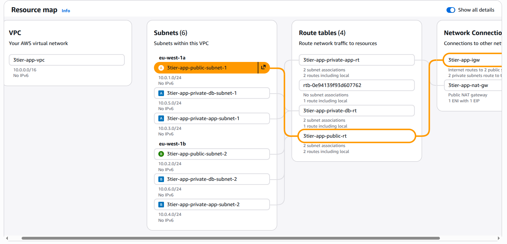
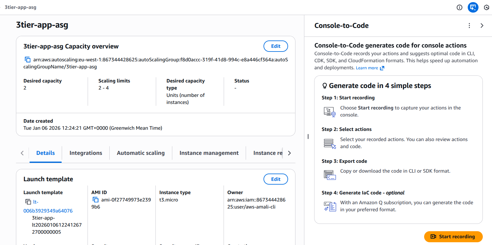
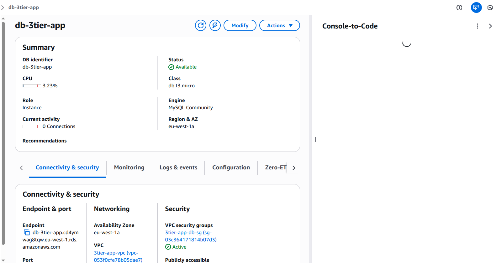
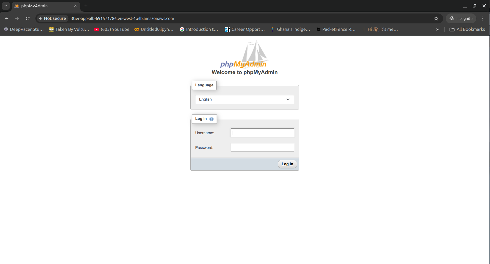
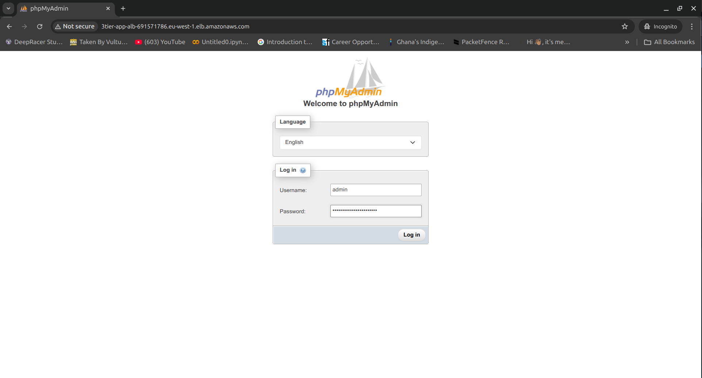
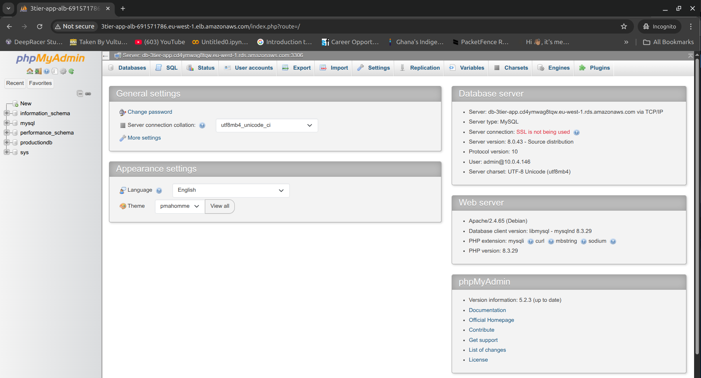

# 3-Tier AWS Architecture with Terraform

This project deploys a highly available, scalable, and secure 3-tier architecture on AWS using Terraform modules.

## Architecture Overview

The architecture consists of three layers:

1.  **Presentation Layer (Public)**:
    *   **ALB (Application Load Balancer)**: Distributes incoming traffic to the application servers.
    *   **Public Subnets**: Host the ALB and NAT Gateway.
2.  **Application Layer (Private)**:
    *   **EC2 Auto Scaling Group**: Runs phpMyAdmin in Docker containers to manage the RDS database.
    *   **Private App Subnets**: Host the EC2 instances. Outbound internet access is provided via NAT Gateway.
3.  **Data Layer (Private)**:
    *   **RDS MySQL**: Managed database service.
    *   **Private DB Subnets**: Host the RDS instance. Isolated from the internet.

### VPC and Subnets


## Modules

*   `networking`: VPC, Subnets (Public, Private App, Private DB), IGW, NAT Gateway, Route Tables.
*   `security`: Security Groups for ALB, App, and DB tiers with strict ingress/egress rules.
*   `alb`: Application Load Balancer, Target Group with sticky sessions, and Listener.
*   `compute`: Auto Scaling Group and Launch Template using Ubuntu 22.04. Runs phpMyAdmin in Docker to provide a web interface for managing the RDS MySQL database.

### Auto Scaling Group


*   `database`: RDS MySQL instance and DB Subnet Group.

### RDS Database


## Prerequisites

*   Terraform installed (>= 1.0.0)
*   AWS Credentials configured

## Deployment Instructions

1.  Initialize Terraform:
    ```bash
    terraform init
    ```

2.  Review the plan:
    ```bash
    terraform plan
    ```

3.  Apply the configuration:
    ```bash
    terraform apply
    ```

### Terraform Apply Output


## Outputs

*   `alb_dns`: The DNS name of the Application Load Balancer. Access this URL in your browser to see phpMyAdmin.
*   `rds_endpoint`: The endpoint of the RDS MySQL database.
*   `asg_name`: The name of the Auto Scaling Group.
*   `app_instance_ips`: Private IP addresses of the EC2 instances in the Auto Scaling Group.

## Application Details

### phpMyAdmin Access

The application tier runs phpMyAdmin in Docker containers, providing a web-based interface to manage the RDS MySQL database:

*   **Access URL**: Use the ALB DNS name (from `alb_dns` output)
*   **Login Credentials**:
    *   Username: `admin`
    *   Password: `YourStrongPassword`

#### phpMyAdmin Login Page


#### Entering Credentials


#### Successfully Connected


### Key Features

*   **Dockerized Application**: phpMyAdmin runs in Docker containers for consistency and easy updates
*   **Sticky Sessions**: ALB configured with sticky sessions to maintain user sessions across requests
*   **Auto Scaling**: Automatically scales between 2-4 instances based on demand
*   **High Availability**: Instances distributed across multiple availability zones
*   **Session Persistence**: phpMyAdmin sessions stored on host volumes to persist across container restarts

### Health Check


## Security

*   **Least Privilege**: Security groups only allow necessary traffic between tiers.
*   **Isolation**: Database and Application servers are in private subnets.
*   **Secrets**: Database password is marked as sensitive (in a real production environment, use AWS Secrets Manager).

## Author

[Isaac Obo Enimil]
